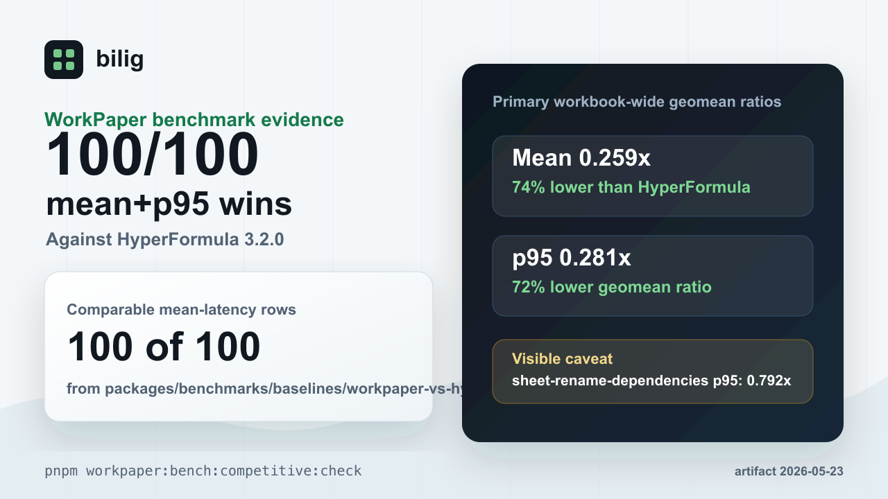

# What The WorkPaper Benchmark Proves

Status: public benchmark explainer for `@bilig/headless`

This page is the short, shareable version of the WorkPaper benchmark claim. It
turns a checked-in artifact into a plain-English evaluation guide without
inflating what the benchmark can prove.



## The Claim

The public source of truth is
`packages/benchmarks/baselines/workpaper-vs-hyperformula.json`.

The artifact records WorkPaper `100/100` mean-latency wins on
scorecard-eligible comparable workloads against HyperFormula `3.2.0`. The same
artifact has `100/100` workloads winning both mean and p95 latency.

Ratios below `1.0x` mean WorkPaper is faster on that metric. The numbers are not
hand-maintained marketing copy; `pnpm public:evidence:check` verifies this page
against checked artifacts.

## Artifact Link

- HyperFormula:
  [`packages/benchmarks/baselines/workpaper-vs-hyperformula.json`](../packages/benchmarks/baselines/workpaper-vs-hyperformula.json)

## Workbook-Wide Lane

The current checked-in WorkPaper-vs-HyperFormula artifact records WorkPaper
`100/100` mean-latency wins on scorecard-eligible comparable workloads:

| Lane    | Comparable Workloads | WorkPaper Mean Wins | HyperFormula Mean Wins |
| ------- | -------------------: | ------------------: | ---------------------: |
| Overall |                `100` |               `100` |                    `0` |
| Public  |                 `73` |                `73` |                    `0` |
| Holdout |                 `27` |                `27` |                    `0` |

The artifact was generated at `2026-05-23T17:51:04.599Z`.

The overall directional mean-ratio geomean is `0.2586071973976171`, and the
overall directional p95-ratio geomean is `0.2806672128213908`.

The current worst p95 row is `sheet-rename-dependencies`, where the current
WorkPaper-to-HyperFormula p95 ratio is `0.7917355369127405`.

## What It Proves

It proves that the checked-in WorkPaper runtime is faster than HyperFormula on
both mean and p95 latency for every comparable row represented in this artifact.

The covered families include workbook build and rebuild paths, runtime restore
from snapshot, sheet lifecycle, named expressions, dirty execution, batch edits,
structural row and column edits, range reads, aggregations, conditional
aggregation, and lookup workloads.

It also proves the public claim is auditable from the repository. The expected
artifact shape is checked by:

```bash
pnpm workpaper:bench:competitive:check
pnpm public:evidence:check
```

## What It Does Not Prove

It does not prove that bilig is a complete Excel clone.

It does not prove full formula parity with Excel, Google Sheets, or every other
formula engine.

It does not prove future p95 rows will stay faster after new workloads are
added. The honest claim is that the checked headless runtime leads this
HyperFormula comparison artifact today, not that every future workbook shape is
covered.

It does not prove that browser-grid rendering, import/export, collaboration, or
every user workload is faster. This benchmark is about the headless WorkPaper
runtime path.

If the artifact is regenerated and the metrics change, the public claim must
change with it.

## How To Verify

For the benchmark evidence, start with:

- [`docs/headless-workpaper-benchmark-evidence.md`](headless-workpaper-benchmark-evidence.md)
- [`packages/benchmarks/baselines/workpaper-vs-hyperformula.json`](../packages/benchmarks/baselines/workpaper-vs-hyperformula.json)
- [`docs/public-evidence.json`](public-evidence.json)
- [`docs/assets/workpaper-benchmark-card.png`](assets/workpaper-benchmark-card.png)

Run the checked gates:

```bash
pnpm workpaper:bench:competitive:check
pnpm public:evidence:check
```

## Shareable Copy

Short:

> bilig's WorkPaper benchmark currently records `100/100` comparable workloads
> winning both mean and p95 against the checked HyperFormula artifact.

Reply-sized:

> the useful part is the audit trail: a checked WorkPaper-vs-HyperFormula
> artifact, public evidence generated from that artifact, and caveats that name
> what the benchmark does not cover.
